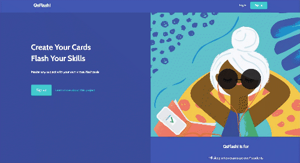
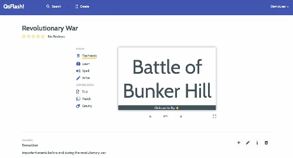
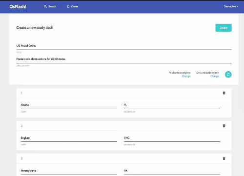
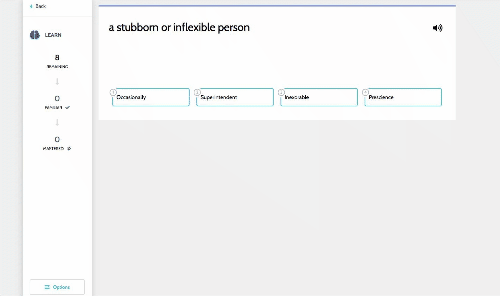
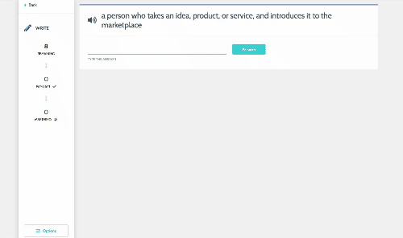
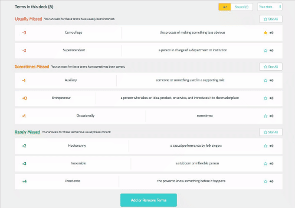
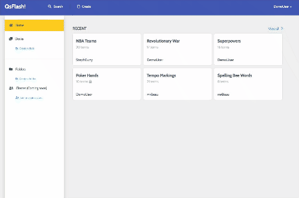
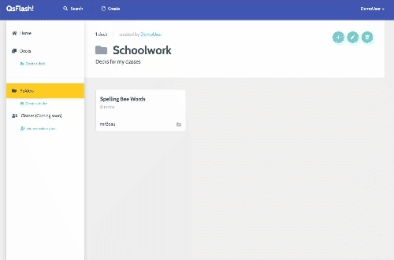

# QsFlash!

QsFlash! is a study application that enables users to create virtual flashcards. Through the use of interactive learning games, QsFlash provides an easy and convenient replacement for the old-fashioned paper flashcard.

[LIVE SITE](https://https://qsflash.herokuapp.com/)

## Features

Log in and show the user's most recent flashcard decks.



Flip and scroll virtual flashcards.



Create, edit, and delete flashcards in a deck. Reorder cards and flip terms and
definitions.



Study cards by taking a multiple choice test.



Master cards with spelling and writing tests.



Sort flashcards by alphabetically or by terms that need more studying. Star flashcards
and filter by starred cards.



Search decks and sort results by most recent, most studied, or highest rated.



Organize decks by adding them to folders.



## Technologies

**Backend**

- Ruby on Rails
- PostgreSQL

**Frontend**

- React.js
- Redux.js

**Packages**

- React-beautiful-dnd
- React onClickOutside
- React Say
- React Spinners
- React Textfit
- React Uuid

## Code Snippets

After a user creates a folder to organize their decks, they are given the option
to either add their existing decks to the folder, or create a new deck that will 
be placed in the folder.

When assigning a current deck, all decks the current user has
created or studied must be fetched, as well as all FolderDecks (used to determine
whether a deck already belongs to the folder).

```javascript
this.props.fetchDecks([this.props.ownProps.match.params.folderId])
  .then(() => this.props.fetchFolderDecks(this.props.folder.id))
```

These decks are then assigned a folderId key in the folder container.

```javascript
  let usersDecks = [];
  let folder = state.entities.folders[ownProps.ownProps.match.params.folderId];
  for (let i = 0; i < allDecks.length; i++) {
    const deck = allDecks[i];
    if (deck.visibility === "Everyone" || (deck.visibility === "Just me" && deck.ownerId === state.entities.users[state.session.id].id)) {
      if (folder && folderDecks[deck.id]) {
        deck.folderDeckId = folderDecks[deck.id].id;
        visibleDecks.push(deck);
      }
      usersDecks.push(deck);
    }
  }
```

The folder container renders a plus or minus button for each deck in the add decks modal 
based on whether a not a deck is already part of the folder (has a folderDeckId).

```javascript
<i onClick={this.addRemoveDeck(deck).bind(this)} className={deck.folderDeckId ? "fas fa-minus deck-in-folder" : "fas fa-plus deck-not-in-folder"}></i>
```

When the user clicks this button, the addRemoveDeck function either creates or
deletes the FolderDeck and refetches all FolderDecks so the modal buttons update.

```javascript
addRemoveDeck(deck) {
  return e => {
    //add folderdeck
    if (!deck.folderDeckId) {
      this.props.createFolderDeck({deckId: deck.id, folderId: this.props.folder.id})
        .then(() => this.props.fetchFolderDecks(this.props.folder.id));
    } else {
      this.props.deleteFolderDeck(deck.folderDeckId)
        .then(() => this.props.fetchFolderDecks(this.props.folder.id));
    }
  }
}
```

When a user wants to create a new deck and assign it to the folder, they need to
be redirected to the create-deck page. In order to assign the new deck to the correct folder,
the folder information has to be passed to the create-deck page. This is accomplished
by using the react-router-dom Link component and passing the folderId through
the state props.

```javascript
<Link id="folder-modal-new" className="small-deck-tile folder-modal-new" 
  to={{
    pathname: '/create-deck',
    state: {
      folderId: this.props.folder.id
    }
  }}
>
  <p>+ CREATE A NEW DECK</p>
</Link>
```
Then, at the time the deck is created, there is a check for whether there is a
state prop and if it has a folderId key. If it does, a new FolderDeck, which joins
the folder and the new deck, is persisted to the database through dispatch of the
createFolderDeck thunk action.

```javascript
if (that.props.location && that.props.location.state && that.props.location.state.folderId) {
  that.props.createFolderDeck({ deckId: deck.deck.id, folderId: that.props.location.state.folderId })
}
```