# QsFlash!

QsFlash! is a study application that enables users to create virtual flashcards. Through the use of interactive learning games, QsFlash provides an easy and convenient replacement for the old-fashioned paper flashcard.

## Demo - https://qsflash.herokuapp.com/

## Table of Contents

- [QsFlash!](#qsflash-)
  * [Demo - https://qsflash.herokuapp.com/](#demo---https---qsflashherokuappcom-)
  * [App Screenshots](#app-screenshots)
  * [Clone Project](#clone-project)

## App Screenshots

| Splash Page        | Signup           | Latest   | Recent   |
| :-------------: |:-------------:| :-------------:| :-------------:|
| 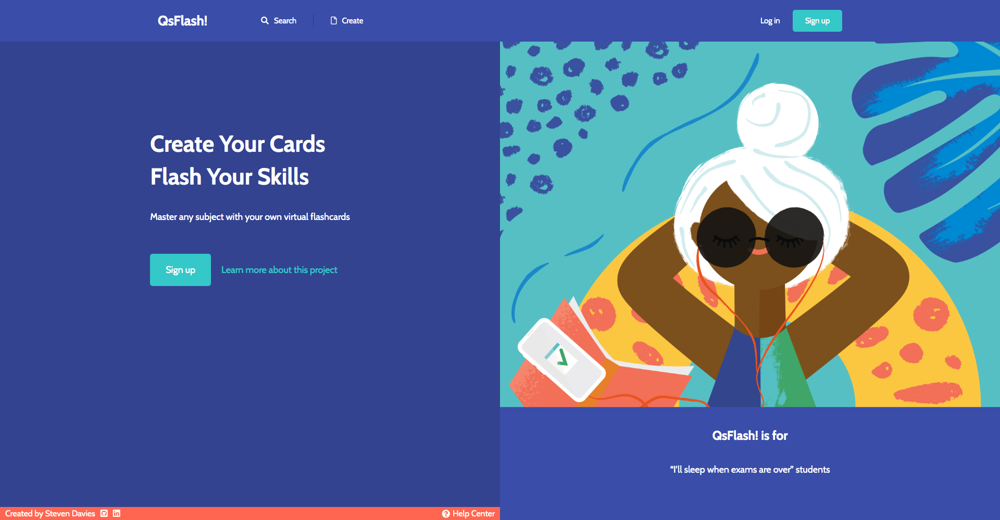 | 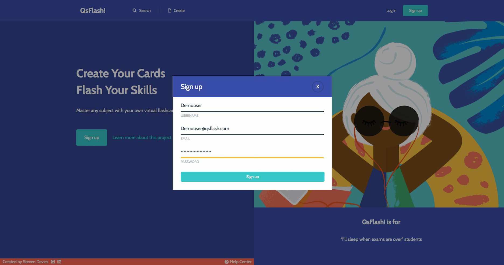 | 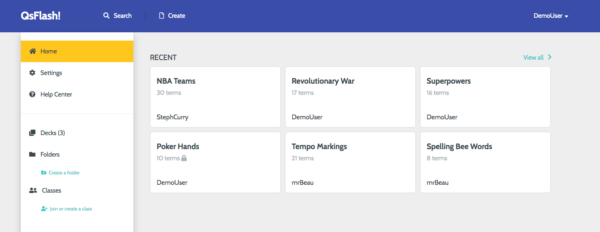 | 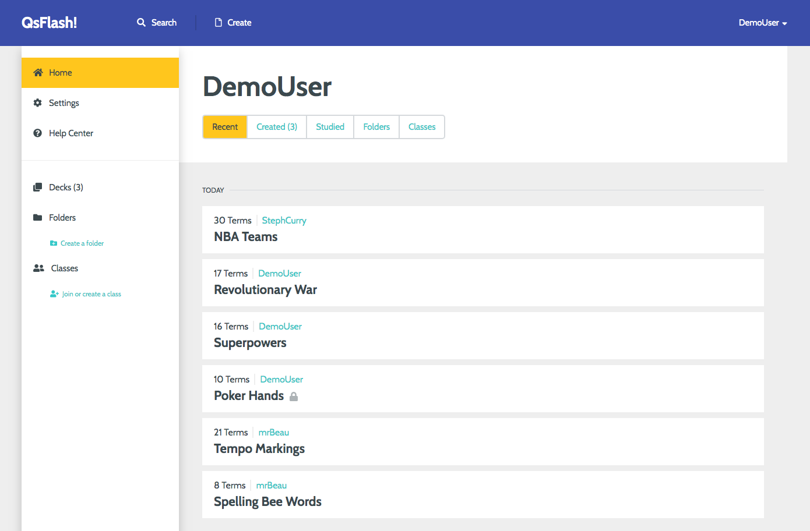 |

| New Deck        | Flash Cards           | Sorted Terms   | Multiple Choice   |
| :-------------: |:-------------:| :-------------:| :-------------:|
| 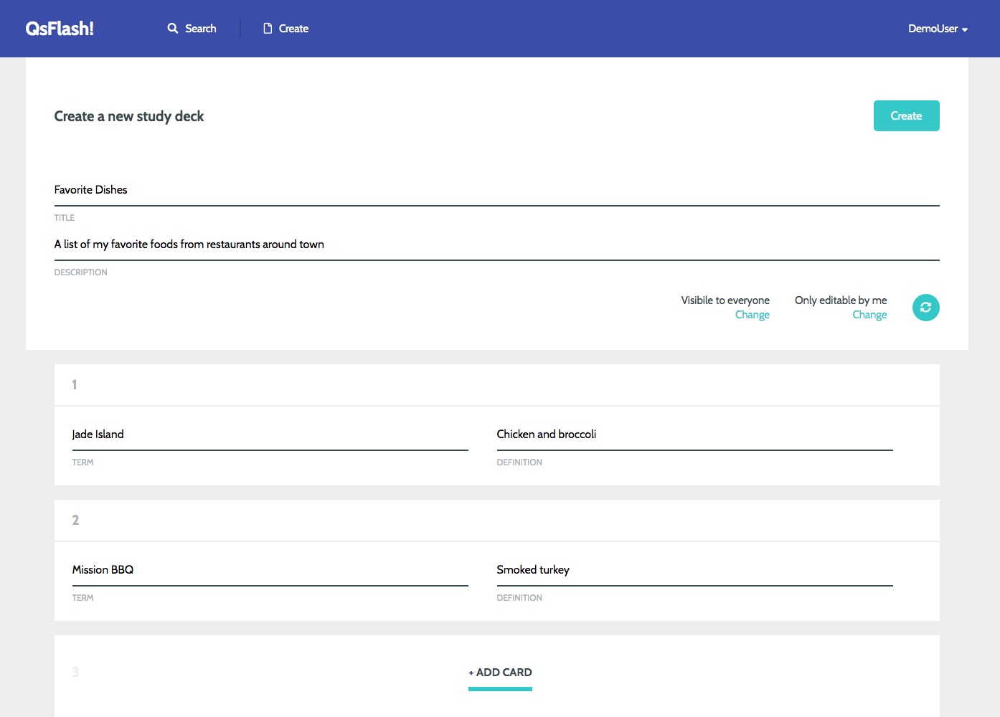 | 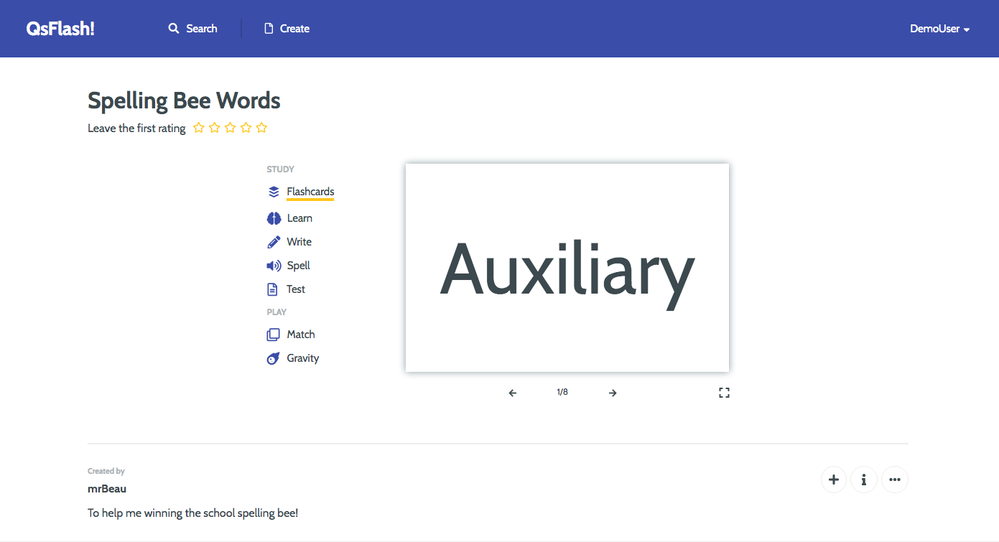 | 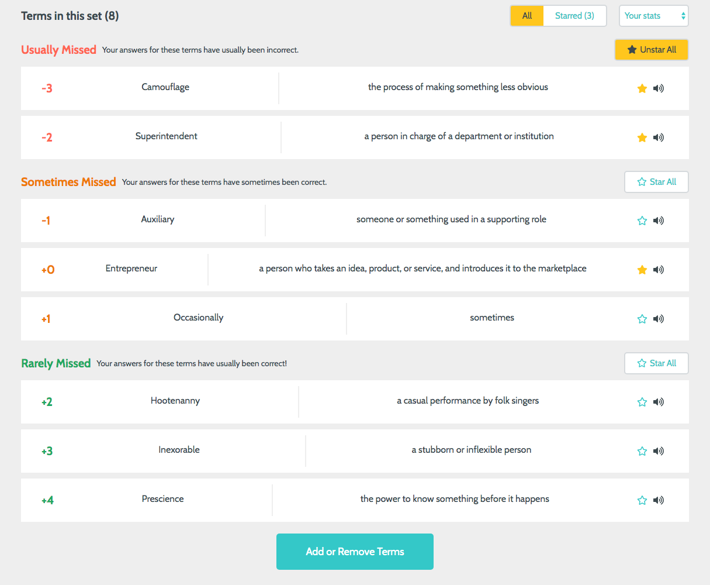 | 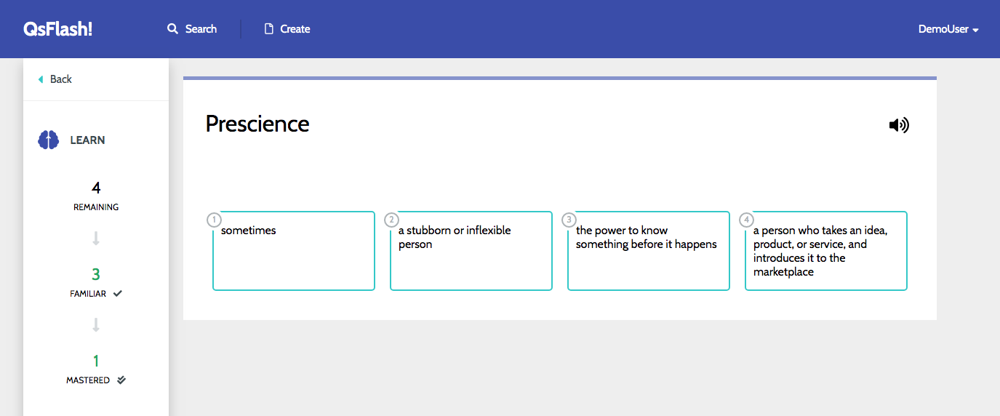 |

| Options       | Spelling           | Incorrect   |
| :-------------: |:-------------:| :-------------:|
| 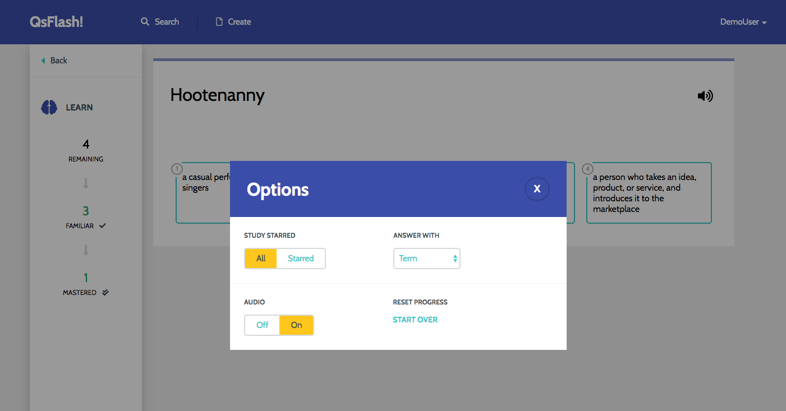 | 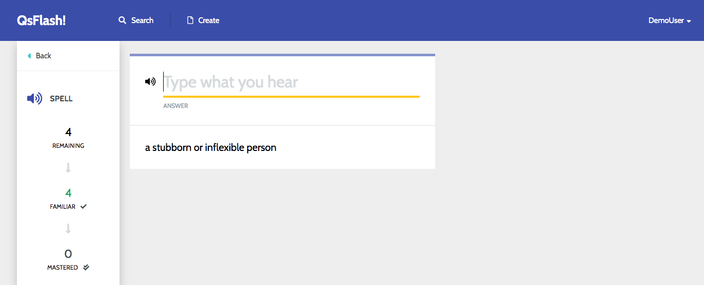 | 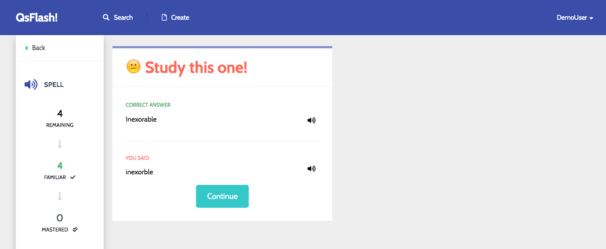 |

## Code Snippets

## Clone Project

```shell
git clone https://github.com/s-davies/QsFlash.git
```

